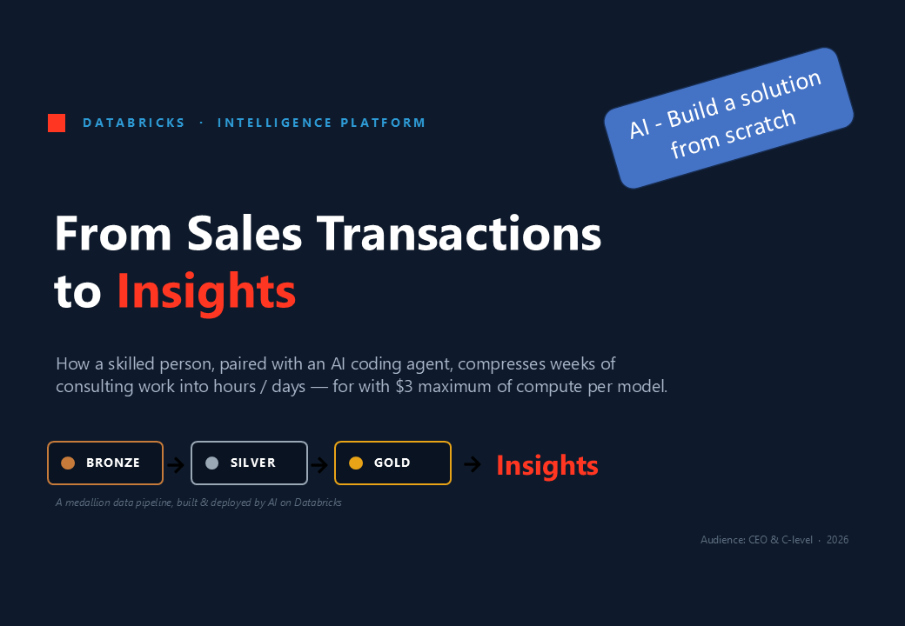
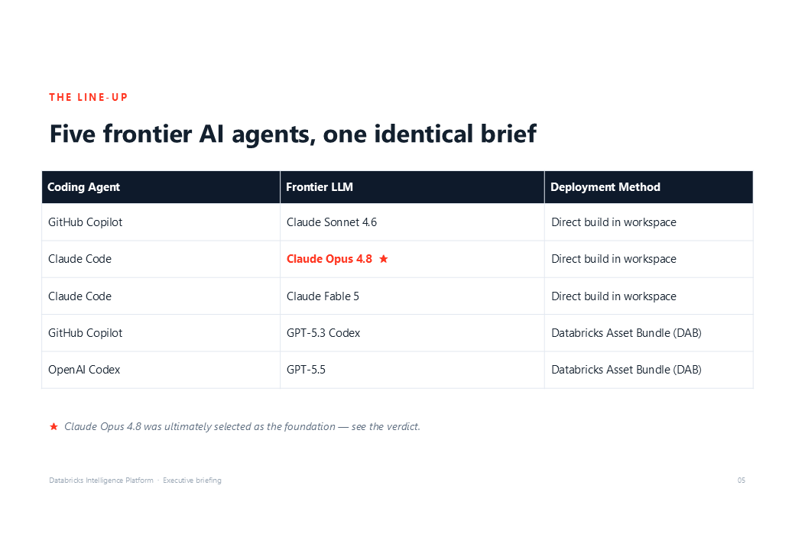
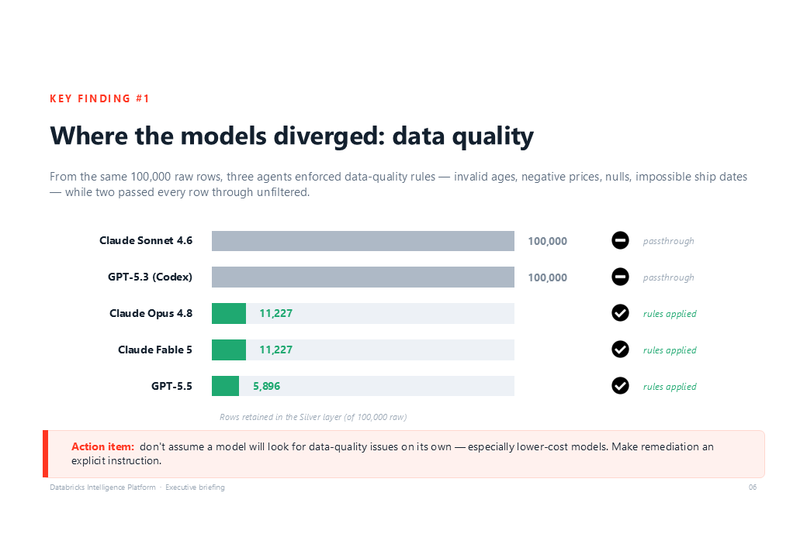
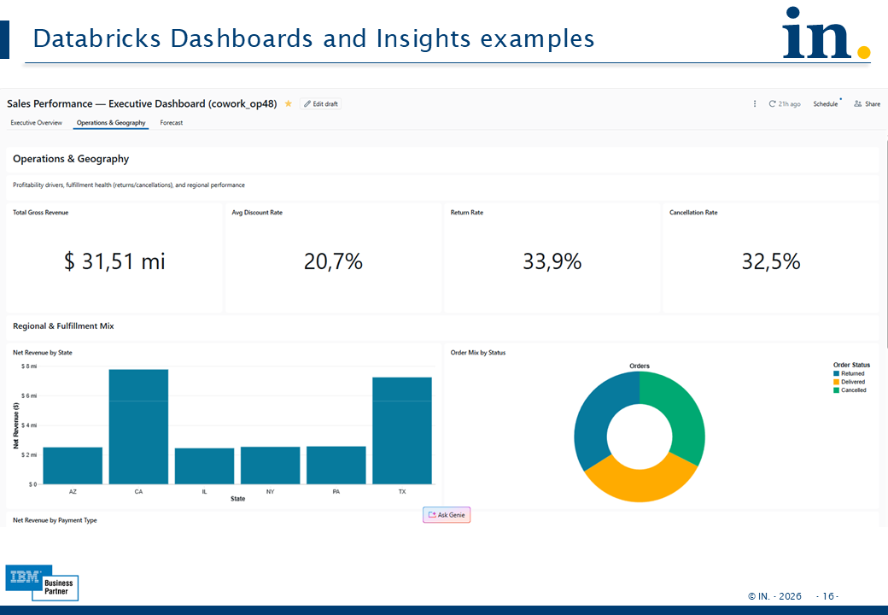

# Databricks Intelligence Platform — From Sales Transactions to Insights



This repository shows, end-to-end, how **AI coding agents, prompt engineering, MCP servers, and specialized agent skills** can be combined to build a complete data solution from scratch. Using the Databricks MCP Server and its associated skills, the workflow covers the entire lifecycle—from data ingestion and transformation to **insight generation and executive presentation** creation.

Its purpose is to showcase how modern AI technologies are becoming strategic business enablers, helping organizations make better decisions, operate more efficiently, uncover new opportunities, and deliver greater value to customers and stakeholders.

To implement this solution using a single instruction file, we will configure multiple agent skills and install an additional MCP Server through the Databricks AI Developer Kit (AI-DEV-KIT). This setup enables the AI agent to orchestrate the complete workflow with minimal manual intervention while leveraging Databricks-native capabilities throughout the process.

The core idea: a skilled person, paired with a frontier AI coding agent, can
compress weeks of consulting work into hours — for roughly **$3 of compute per
model** — by handing each agent a single instruction file and letting it design,
build, and deploy a full Bronze → Silver → Gold medallion pipeline on Databricks. 

After the data pipeline deployed at Databricks, build CEO / CFO dashboards also using agents

## What this repo demonstrates

1. **AI + prompt engineering** — one identical instruction file drives the whole
   build (except data catalog name, schema and volume information). The agent reads the data, infers the business rules, designs the schema, writes the pipeline, and deploys it with no further human guidance.
2. **Agent capabilities + MCP** — every implementation talks to a live Databricks
   workspace through the [Databricks AI Dev Kit](https://github.com/databricks-solutions/ai-dev-kit)
   MCP server and skills already setup, so the agent can list warehouses, create catalogs/schemas, deploy
   pipelines, and (in one case) build dashboards directly through its own tooling.
3. **A complete solution from scratch** — Spec-Driven Development artifacts
   (`requirements.md`, `design.md`, `tasks.md`), pipeline SQL, data-quality logic,
   deployment, audit scripts, and dashboards — all AI-generated.
4. **The presentation** — the findings were packaged into an executive briefing
   (slides shown throughout this README and doc/ presentation slides).

## The experiment: same brief, five frontier agents



The same task, the same single instruction file, and the same Spec-Driven
Development (SDD) process were given independently to several **coding agent /
frontier LLM** combinations. Each had to produce the specs, then build and deploy
a Bronze → Silver → Gold medallion **Lakeflow Spark Declarative Pipeline (SDP)**
from the [sales transactions dataset](sales_transactions__LLMs_Agent/sales_transcation_data_raw).

| Folder | Coding Agent | LLM | Deployment Method |
|---|---|---|---|
| [SDP__Sonnet46](sales_transactions__LLMs_Agent/SDP__Sonnet46) | GitHub Copilot | Claude Sonnet 4.6 | Direct build in the workspace |
| [SDP__Opus48](sales_transactions__LLMs_Agent/SDP__Opus48) ⭐ | Claude Code | Claude Opus 4.8 | Direct build in the workspace |
| [SDP_Fable5__cowork](sales_transactions__LLMs_Agent/SDP_Fable5__cowork) | Claude Code | Claude Fable 5 | Direct build in the workspace |
| [SDP_GPT53_codex](sales_transactions__LLMs_Agent/SDP_GPT53_codex) | GitHub Copilot | GPT-5.3 Codex | Databricks Asset Bundle (DAB) |
| [SDP__GPT55](sales_transactions__LLMs_Agent/SDP__GPT55) | OpenAI Codex | GPT-5.5 | Databricks Asset Bundle (DAB) |

⭐ **Claude Opus 4.8** was ultimately selected as the foundation for further work —
see the [full findings and verdict](sales_transactions__LLMs_Agent/README.md).

## Key finding: where the models diverged — data quality



From the same 100,000 raw rows, three agents/LLMs (Opus 4.8, Fable 5, GPT-5.5) enforced
data-quality rules — invalid ages, negative prices/quantities, nulls, impossible
ship dates — while two (Sonnet 4.6, GPT-5.3 Codex) passed every row through
unfiltered.

**Action item:** don't assume a model will hunt for data-quality issues on its
own — especially lower-cost models. Make remediation an explicit instruction.

## The result: dashboards and insights



The selected Opus 4.8 pipeline was extended to build an executive dashboard
directly in the Databricks workspace (executive overview, operations & geography,
and a forecast tab), plus AI-generated audit scripts and an auto-ingestion
workflow — coordinated by Opus 4.8 acting as the Agent Manager.

## Getting started

1. **Install the MCP server / AI Dev Kit** — see
   [Setup_Intruncstions.md](sales_transactions__LLMs_Agent/Setup_Intruncstions.md).
   On PowerShell (Windows):
   ```powershell
   irm https://raw.githubusercontent.com/databricks-solutions/ai-dev-kit/main/install.ps1 | iex
   ```
   On Bash (macOS / Linux):
   ```bash
   curl -fsSL https://raw.githubusercontent.com/databricks-solutions/ai-dev-kit/main/install.sh | sh
   ```
   Prerequisites: `git`, Databricks CLI, and `uv`.
2. **Verify the MCP server works** — prompt your agent: *"List my warehouses."*
3. **Deploy a solution** — point the agent at an instruction file, e.g.:
   *"Read the instructions and deploy the SDP solution at Databricks."*
4. **Explore the implementations and the full write-up** in
   [sales_transactions__LLMs_Agent/](sales_transactions__LLMs_Agent/README.md).

## Repository layout

- [sales_transactions__LLMs_Agent/](sales_transactions__LLMs_Agent/) — the full
  benchmark: five implementations, the raw dataset, setup instructions, and the
  detailed findings README.

- [doc/](doc/) - presentation slides and also some interesting documents from IBM and AWS

- **IBM Institute for Business Value**

  **Title:** IBM CEO Study: 5 Plays for AI-First Transformation  
  **Format:** Interactive Report & Executive Insights  
  **Core Focus for CEOs:** Outlines a clear, top-down strategy for the C-suite. It covers scaling enterprise AI initiatives, introducing "AI-agent flywheels," and how the convergence of talent and technology impacts leadership roles (such as the rising prominence of the Chief AI Officer).  
  **Direct Access:** You can review the strategic summary and access the main content here: [IBM 2026 CEO Study]

- **AWS**   
- The transformative impact of generative AI on business workflows in a highly regulated industry

- **IN - SDP project slides** - [open presentation link](doc/IN_Databricks__Intelligence_Platform__agents_project.pdf)

---

## Benchmark and Reproducibility Notes

> ⚠️ This is a small, controlled benchmark. LLMs are probabilistic — prompt,
> context, and evaluation changes can shift the ranking. Treat these results as a
> point-in-time comparison, not a definitive ranking. Expert review remains
> essential before any AI-generated solution goes to production.

Each Agent/LLM combination included in this repository provides its own implementation artifacts, documentation, and generated outputs. These files are preserved to demonstrate the specific solution produced by that particular setup.

When executing the project using the provided `instructions.md` file, your results may differ from the examples included in this repository. Variations can occur due to differences in agent harnesses, MCP server releases, skill definitions, or execution environments. Nevertheless, because all implementations leverage the same core skills and MCP server capabilities, they consistently converge on a similar architectural pattern.
